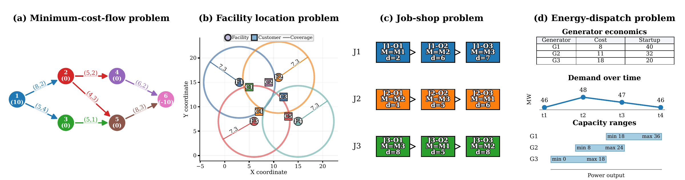
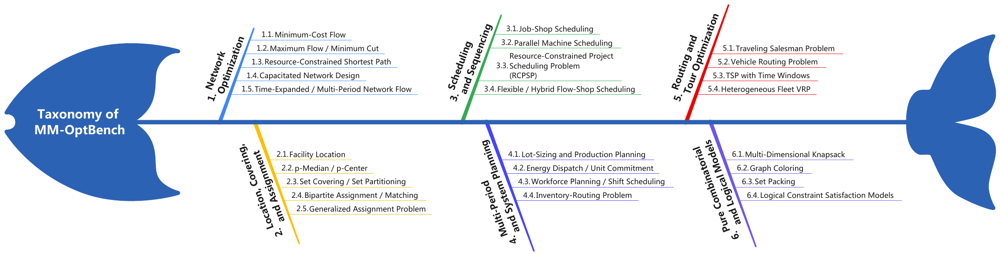
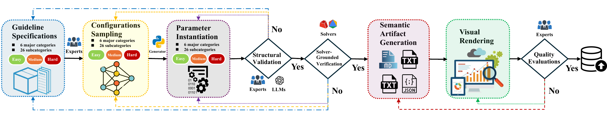
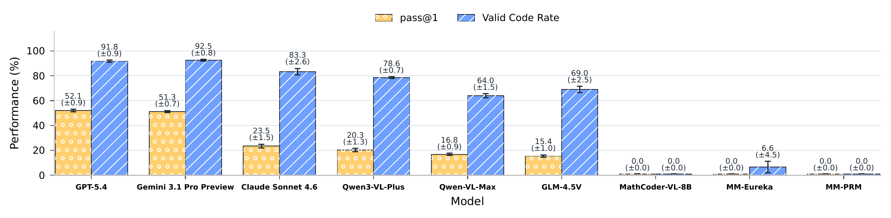
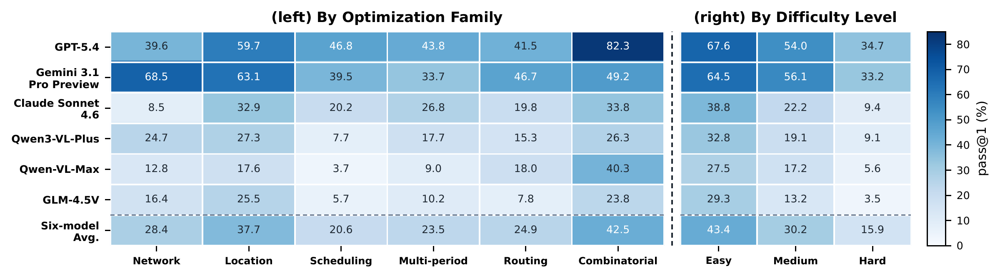
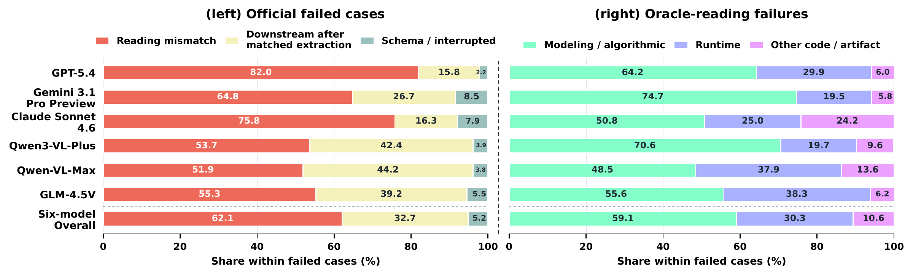

# MM-OptBench

<p align="center">
  
</p>

**MM-OptBench: A Solver-Grounded Benchmark for Multimodal Optimization Modeling**

[](#citation)
[](#dataset)
[](#benchmark)
[](#local-evaluation)
[](LICENSE)
[](https://github.com/ZhongLIFR/MM-OptBench)

**NeurIPS 2026 Evaluations and Datasets Track · Poster**

Zhong Li, Qi Huang, Yuxuan Zhu, Mohammad Mohammadi Amiri, Niki van Stein,
Thomas Bäck, Matthijs van Leeuwen, Zaiwen Wen, and Lincen Yang.

[Citation](#citation) · [Overview](#overview) · [Benchmark](#benchmark) · [Results](#results) ·
[Dataset](#dataset) · [Quick Start](#quick-start) ·
[Test Prompts](#test-prompts) · [Model Evaluation](#model-evaluation) ·
[Local Evaluation](#local-evaluation) · [License](#license)

## Citation

Please cite MM-OptBench when using the dataset. Download the BibTeX entry:
[citation.bib](citation.bib).

```bibtex
@inproceedings{li2026mmoptbench,
  title={{MM-OptBench}: A Solver-Grounded Benchmark for Multimodal Optimization Modeling},
  author={Li, Zhong and Huang, Qi and Zhu, Yuxuan and Amiri, Mohammad Mohammadi and van Stein, Niki and B{\"a}ck, Thomas and van Leeuwen, Matthijs and Wen, Zaiwen and Yang, Lincen},
  booktitle={NeurIPS 2026 Evaluations and Datasets Track},
  year={2026}
}
```

## Overview

MM-OptBench evaluates whether multimodal models can translate a problem described
through **text and visual artifacts** into a mathematical optimization model and
executable solver code. Essential problem information appears in tables, graphs,
maps, schedules, and planning dashboards.

**Task:** text + visual inputs → mathematical formulation + executable solver
code → solution checking against solver-grounded references.

- **Multimodal inputs:** the text states the task and modeling rules, while the
  accompanying images carry instance-specific information.
- **Diverse optimization structures:** 780 instances span 26 problem types,
  six families, and three balanced difficulty levels.
- **Complete reference artifacts:** each instance includes structured data, a
  mathematical formulation, a reference solver, and its solution.

[](assets/figures/examples.png)

*Representative inputs from the paper: network structure and costs, spatial
coverage, operation precedence, and generator economics and demand.*

This repository provides the complete test dataset, reference solvers, test
prompts, model-evaluation framework, and a local solution evaluator. All instance
files are included in [dataset/](dataset/).

## Benchmark

| Property | Coverage |
| --- | --- |
| Instances | 780 |
| Optimization families / problem types | 6 / 26 |
| Difficulty levels | Easy, medium, hard |
| Instances per problem type | 30: 10 at each difficulty |
| Instances per difficulty | 260 |
| Input images | 939; one to four per instance |

| Family | Problem types | Instances |
| --- | ---: | ---: |
| [Network optimization](dataset/network_optimization/) | 5 | 150 |
| [Location, covering, and assignment](dataset/location_covering_assignment/) | 5 | 150 |
| [Scheduling and sequencing](dataset/scheduling_sequencing/) | 4 | 120 |
| [Multi-period system planning](dataset/multi_period_system_planning/) | 4 | 120 |
| [Routing and tour optimization](dataset/routing_tour_optimization/) | 4 | 120 |
| [Combinatorial and logical models](dataset/combinatorial_logical/) | 4 | 120 |

[](assets/figures/taxonomy.png)

The taxonomy is organized by mathematical structure. Difficulty varies with
structural complexity and the information encoded in the visual inputs.

### Construction

[](assets/figures/construction-pipeline.png)

Construction starts from structured optimization instances and reference solves,
then produces aligned task text, visual inputs, mathematical models, and solution
artifacts. The resulting examples retain a common reference across modalities.

## Results

Results reported in the paper.

### Overall Performance

[](assets/figures/overall-results.png)

| Model | Valid Code Rate (%) | pass@1 (%) | pass@4 (%) |
| --- | ---: | ---: | ---: |
| GPT-5.4 | 91.8 ± 0.9 | 52.1 ± 0.9 | 68.3 |
| Gemini 3.1 Pro Preview | 92.5 ± 0.8 | 51.3 ± 0.7 | 64.4 |
| Claude Sonnet 4.6 | 83.3 ± 2.6 | 23.5 ± 1.5 | 31.3 |
| Qwen-VL-Max | 64.0 ± 1.5 | 16.8 ± 0.9 | 25.5 |
| Qwen3-VL-Plus | 78.6 ± 0.7 | 20.3 ± 1.3 | 34.7 |
| GLM-4.5V | 69.0 ± 2.5 | 15.4 ± 1.0 | 29.1 |
| Six-model average | 79.9 | 29.9 | 42.2 |

Valid Code Rate measures executable outputs; pass@1 measures successful solutions
on a single attempt. For these six models, both are mean ± standard deviation
over five runs: one at temperature 0.0 and four at 0.4. pass@4 measures success
within the four stochastic attempts.

The gap between executable code and correct solutions highlights the difficulty
of recovering visual information and translating it into the right optimization
model. The strongest baseline reaches 52.1% pass@1 and 68.3% pass@4.

<details>
<summary><strong>Performance by optimization family and difficulty</strong></summary>

[](assets/figures/family-difficulty-results.png)

| Difficulty | Instances | Six-model average pass@1 (%) | Six-model average pass@4 (%) |
| --- | ---: | ---: | ---: |
| Easy | 260 | 43.4 | 59.4 |
| Medium | 260 | 30.2 | 42.6 |
| Hard | 260 | 15.9 | 24.7 |

The final heatmap row gives the six-model average.

</details>

<details>
<summary><strong>Math-specialized baselines</strong></summary>

| Model | Valid Code Rate (%) | pass@1 (%) |
| --- | ---: | ---: |
| MathCoder-VL-8B | 0.0 | 0.0 |
| MM-Eureka | 6.6 | 0.0 |
| MM-PRM | 0.0 | 0.0 |

</details>

<details>
<summary><strong>Failure analysis from the paper</strong></summary>

[](assets/figures/failure-breakdown.png)

The left panel groups failures using extraction-based diagnosis; the right panel
examines failures when structured instance data are supplied in place of images.
Percentages are within the failed outputs of each setting in a representative
run. The final row pools the six general-purpose models.

</details>

## Dataset

Each instance is a self-contained directory:

```text
dataset/<family>/<problem>/<difficulty>/<instance_id>/
  task_input.txt
  visuals/visual_*.png
  canonical_specification.txt
  meta.json
  ground_truth/
    instance_data.json
    math_model.md
    solver_ref.py
    solution_ref.json
evaluate.py
scoring.py
run_models.py
evaluation/
prompts/
requirements.txt
requirements-eval.txt
citation.bib
```

The **test input** is `task_input.txt` together with all `visuals/visual_*.png`
files in the same instance. The remaining files are reference artifacts:

| File | Content |
| --- | --- |
| `canonical_specification.txt` | Complete textual specification |
| `meta.json` | Instance metadata and artifact paths |
| `ground_truth/instance_data.json` | Structured instance data |
| `ground_truth/math_model.md` | Mathematical formulation |
| `ground_truth/solver_ref.py` | Reference solver |
| `ground_truth/solution_ref.json` | Reference solution |

For multimodal evaluation, provide the task text and all accompanying input
images. Keep the complete specification and ground-truth files as evaluation
references, outside the model input.

### Browse Examples

| Problem | Task text | Visual input | Reference model |
| --- | --- | --- | --- |
| Maximum flow | [mf_e_001](dataset/network_optimization/maximum_flow/easy/mf_e_001/task_input.txt) | [Graph](dataset/network_optimization/maximum_flow/easy/mf_e_001/visuals/visual_0.png) | [Formulation](dataset/network_optimization/maximum_flow/easy/mf_e_001/ground_truth/math_model.md) |
| Facility location | [fl_e_001](dataset/location_covering_assignment/facility_location/easy/fl_e_001/task_input.txt) | [Map](dataset/location_covering_assignment/facility_location/easy/fl_e_001/visuals/visual_0.png) | [Formulation](dataset/location_covering_assignment/facility_location/easy/fl_e_001/ground_truth/math_model.md) |
| Job-shop scheduling | [jss_e_001](dataset/scheduling_sequencing/job_shop_scheduling/easy/jss_e_001/task_input.txt) | [Schedule](dataset/scheduling_sequencing/job_shop_scheduling/easy/jss_e_001/visuals/visual_0.png) | [Formulation](dataset/scheduling_sequencing/job_shop_scheduling/easy/jss_e_001/ground_truth/math_model.md) |
| Energy dispatch and unit commitment | [educ_e_001](dataset/multi_period_system_planning/energy_dispatch_unit_commitment/easy/educ_e_001/task_input.txt) | [Dashboard](dataset/multi_period_system_planning/energy_dispatch_unit_commitment/easy/educ_e_001/visuals/visual_0.png) | [Formulation](dataset/multi_period_system_planning/energy_dispatch_unit_commitment/easy/educ_e_001/ground_truth/math_model.md) |

## Quick Start

Read an instance directly with Python, without installing a dataset package:

```python
from pathlib import Path

dataset = Path("dataset")
tasks = sorted(dataset.glob("*/*/*/*/task_input.txt"))
print(len(tasks))  # 780

instance = dataset / "network_optimization/maximum_flow/easy/mf_e_001"
task_text = (instance / "task_input.txt").read_text(encoding="utf-8")
image_paths = sorted((instance / "visuals").glob("visual_*.png"))

print(task_text)
print(image_paths)
```

Run these examples and the commands below from the repository root.

## Test Prompts

The evaluator reads the following prompt files directly:

| Prompt | Purpose |
| --- | --- |
| [system.txt](prompts/system.txt) | System instruction for multimodal optimization modeling |
| [solve.txt](prompts/solve.txt) | Default response format: assumptions, mathematical model, and Python code |
| [extraction.txt](prompts/extraction.txt) | Structured data extraction for the extraction stage |
| [fullsolve_json.txt](prompts/fullsolve_json.txt) | Alternative JSON response format for a complete solution |

The default multimodal request combines the system prompt, the instance's
`task_input.txt`, its image filenames and attached images, and the instructions
in `solve.txt`. The response has three sections:

```text
ASSUMPTIONS
MATHEMATICAL_MODEL
PYTHON_CODE
```

The Python code defines `solve()`, returning a JSON-serializable solution
dictionary. Request assembly, including the structured-input variants, is in
[evaluation/prompts.py](evaluation/prompts.py).

To inspect a complete request without calling a model:

```bash
python run_models.py run-instance \
  --instance network_optimization/maximum_flow/easy/mf_e_001 \
  --model MODEL_ID \
  --dry-run \
  --output-dir output/prompt-preview
```

The command prints a run directory containing `request.json`, with the complete
messages and image payloads. No API key is needed for a dry run.

## Model Evaluation

The framework supports image-capable chat-completions endpoints, including
compatible hosted APIs and locally served models. Request construction and dry
runs use only the Python standard library. Install the solver dependencies before
executing model-generated solutions:

```bash
python -m pip install -r requirements-eval.txt
```

Model evaluation executes generated Python. Run it in an isolated environment
with the intended solver packages; the subprocess runner is not a security sandbox.

### Run One Instance

Set your API key in an environment variable and supply the endpoint and model ID:

```bash
export PROVIDER_API_KEY="YOUR_API_KEY"

python run_models.py run-instance \
  --instance network_optimization/maximum_flow/easy/mf_e_001 \
  --model MODEL_ID \
  --base-url https://provider.example/v1 \
  --api-key-env PROVIDER_API_KEY \
  --temperature 0.0
```

The runner appends `/chat/completions` to `--base-url`; provide the API base URL,
not the complete request URL. Replace the example endpoint and model ID with
those supplied by your provider.

### Batch Experiments

```bash
python run_models.py experiment \
  --family network_optimization \
  --problem maximum_flow \
  --difficulty easy \
  --models MODEL_ID \
  --base-url https://provider.example/v1 \
  --api-key-env PROVIDER_API_KEY \
  --mode multimodal \
  --temperature 0.0 \
  --limit 10
```

Omit the family, problem, difficulty, and limit selectors to evaluate all 780
instances. `--models` accepts multiple model IDs on the same endpoint. Each
invocation runs one attempt per selected instance and model. To follow the paper's
five-run setting, run once at temperature 0.0 and four times at 0.4.

| Mode | Input and workflow |
| --- | --- |
| `multimodal` | Task text and images, followed by solver execution and scoring |
| `oracle_reading` | Task wording and structured instance data |
| `verified_extraction` | Extract data from the multimodal input, validate it, then solve from the extracted data |
| `two_stage` | Run the multimodal task, then perform extraction-based diagnosis on failures |

Generated requests, responses, and summaries are written under `output/`, which
is ignored by Git. An interrupted batch can be resumed using the experiment
directory printed by the command:

```bash
python run_models.py resume-experiment output/mmopt_eval/EXPERIMENT_DIRECTORY
```

The resumed experiment uses its saved configuration and the API key from the
configured environment variable. Use `python run_models.py --help` for the
available commands, or `python run_models.py experiment --help` for all options.

## Local Evaluation

Use **Python 3.10 or newer**. The local evaluator needs only the Python standard
library. It reads solution dictionaries; it does not call models or execute
submitted code.

Score one saved solution from the repository root:

```bash
python evaluate.py --instance ba_e_008 --solution /path/to/solution.json
```

Use the fields in that instance's `ground_truth/solution_ref.json` as the solution
format. A quick check using the included reference solution:

```bash
python evaluate.py --instance ba_e_008 \
  --solution dataset/location_covering_assignment/bipartite_assignment/easy/ba_e_008/ground_truth/solution_ref.json
```

For a batch, provide a JSONL file with one record per instance:
`{"instance_id": "ba_e_008", "solution": <solution dictionary>}`.

```bash
python evaluate.py --predictions /path/to/predictions.jsonl
```

The evaluator prints JSON with individual judgments and batch accuracy (a
fraction from 0 to 1 over the supplied instances). Include all 780 instance IDs
for a full-dataset evaluation; each ID must appear only once. The default base
numeric tolerance is `1e-6`, with problem-specific tolerances in
[evaluation/scoring.py](evaluation/scoring.py).

## Reference Solvers

To run the reference solvers, install their numerical dependencies:

```bash
python -m pip install -r requirements.txt
python dataset/location_covering_assignment/bipartite_assignment/easy/ba_e_008/ground_truth/solver_ref.py
```

Gurobi-based solves require a suitable Gurobi license. Each script reads its
local `instance_data.json` and writes `solution_ref.json` in the same directory.

## License

This repository is licensed under [Creative Commons Attribution-ShareAlike 4.0
International (CC BY-SA 4.0)](LICENSE).
